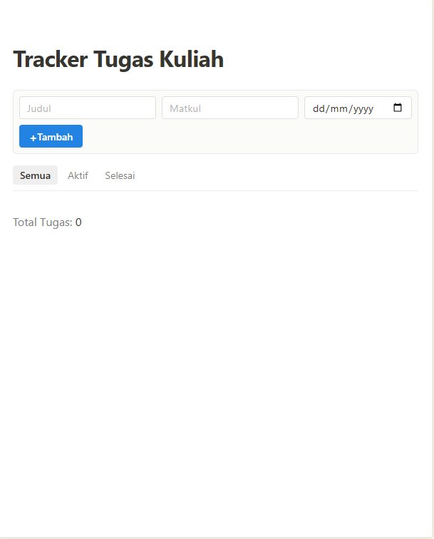
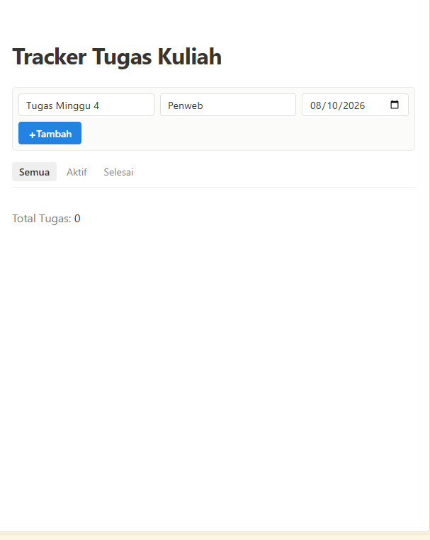
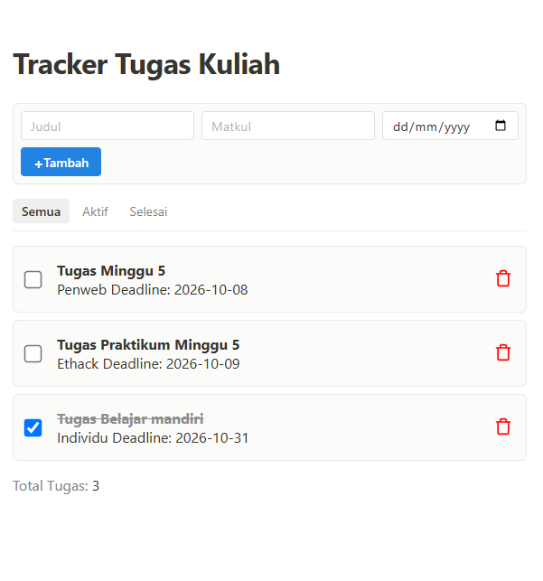
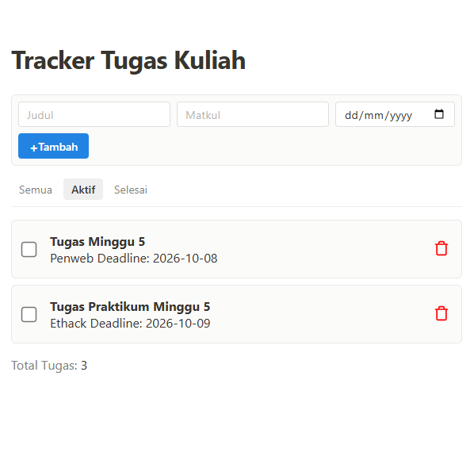
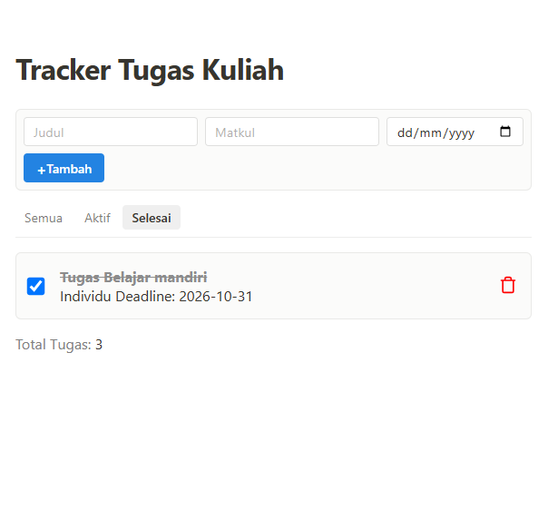

# Tugas Minggu 5 - Tracker Tugas Kuliah

| No | Nama | NRP |
| --- | --- | --- |
| 1 | Asfia Fahmisan | 5027251043 |

## Deskripsi

**Tracker Tugas Kuliah** adalah aplikasi web sederhana untuk mencatat dan mengelola tugas kuliah. Aplikasi ini dibuat menggunakan HTML, CSS, dan JavaScript tanpa framework tambahan.

Pengguna dapat menambahkan tugas berdasarkan judul, mata kuliah, dan deadline. Setiap tugas juga dapat ditandai sebagai selesai, dihapus, atau ditampilkan berdasarkan statusnya.

## Screenshot

### Tampilan utama


### Menambahkan tugas


### Filter tugas



> Nama dan lokasi file gambar dapat disesuaikan dengan screenshot yang akan ditambahkan.

## Fitur

- Menambahkan tugas baru dengan informasi:
  - Judul tugas
  - Mata kuliah
  - Deadline
- Menampilkan seluruh daftar tugas.
- Menandai tugas sebagai selesai atau aktif menggunakan checkbox.
- Menghapus tugas.
- Memfilter tugas berdasarkan status:
  - **Semua**
  - **Aktif**
  - **Selesai**
- Menampilkan jumlah total tugas.
- Menyimpan data tugas pada `localStorage`, sehingga data tetap tersedia setelah halaman dimuat ulang.
- Memberikan validasi ketika judul atau mata kuliah belum diisi.

## Teknologi yang Digunakan

- HTML5
- CSS3
- JavaScript
- Browser `localStorage`

## Struktur File

```text
Tugas/
├── index.html       # Struktur halaman aplikasi
├── styles.css       # Styling dan tata letak aplikasi
├── script.js        # Logika tambah, tampil, filter, selesai, dan hapus tugas
└── readme.md        # Laporan tugas
```

## Cara Menjalankan

1. Buka folder `Tugas`.
2. Buka file `index.html` menggunakan browser.
3. Masukkan judul tugas, mata kuliah, dan deadline jika diperlukan.
4. Klik tombol **Tambah** untuk menyimpan tugas.

Aplikasi dapat dijalankan langsung di browser karena tidak membutuhkan server atau instalasi dependency tambahan.

## Cara Kerja Aplikasi

### Menambahkan tugas

Data dari form akan divalidasi terlebih dahulu. Judul dan mata kuliah wajib diisi. Setelah valid, data tugas disimpan ke dalam array `tasks`, kemudian disimpan ke `localStorage`.

### Menampilkan tugas

Fungsi `renderTask()` digunakan untuk menampilkan data tugas ke halaman. Fungsi ini juga memperbarui jumlah total tugas dan menyesuaikan daftar berdasarkan filter yang sedang dipilih.

### Mengubah status tugas

Ketika checkbox dicentang, properti `completed` pada tugas akan diubah menjadi `true`. Jika checkbox dilepas, status tugas akan kembali menjadi aktif.

### Menyimpan data

Data disimpan menggunakan key `TASKS_DATA` pada `localStorage`. Dengan demikian, daftar tugas tidak langsung hilang ketika halaman di-refresh.

## Kesimpulan

Melalui tugas ini, dibuat sebuah aplikasi pengelolaan tugas sederhana dengan menerapkan:

- Manipulasi DOM menggunakan JavaScript.
- Event listener pada tombol, filter, dan checkbox.
- Pengelolaan data menggunakan array object.
- Penyimpanan data menggunakan `localStorage`.
- Pembuatan tampilan responsif menggunakan CSS.
